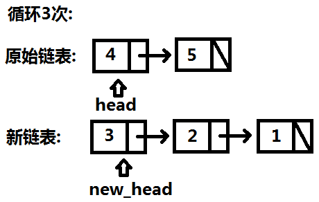

# Go 实现

> [206. 反转链表](https://leetcode-cn.com/problems/reverse-linked-list/)

> [实现代码](https://github.com/bingohuang/go-codes/blob/master/leetcode/editor/cn/p206_ReverseLinkedList_test.go)

## 思路
- 要求: 已知链表头节点指针head，将链表逆序。(不可申请额外空间)


- 整体思路


- 循环过程





- 关键步骤


- 效果


## Go 代码
```go
// 算法1: 翻转链表
func reverseList1(head *ListNode) *ListNode {
	var newHead, next *ListNode

	for head != nil {
		next = head.Next
		head.Next = newHead
		newHead = head
		head = next
	}

	return newHead
}
```

### 复杂度分析
- 时间复杂度：O(N)
- 空间复杂度：O(1)